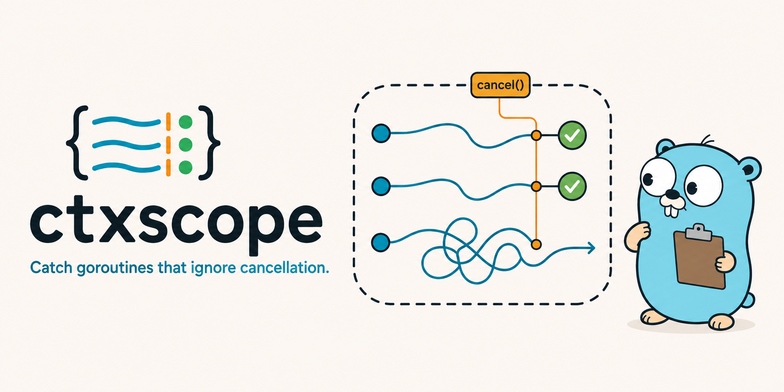

# ctxscope



[](https://github.com/lov3g00d/ctxscope/actions/workflows/ci.yml)
[](https://pkg.go.dev/github.com/lov3g00d/ctxscope)
[](LICENSE)

`ctxscope` tests a cancellation contract: goroutines started for an operation
must stop after that operation's context is canceled.

It labels operation-scoped goroutines with `runtime/pprof`, cancels the
operation, and reports labeled goroutines that remain after a grace period.
Unlike comparing process-wide goroutine counts, unrelated background work does
not affect the result.

The package is intentionally narrower than a process-wide leak detector: it
answers whether the goroutines owned by one operation respected cancellation
within the configured shutdown deadline.

For worker pools and queues, scoped tasks explicitly carry ownership across
goroutines that existed before the inspection began. They distinguish queued
work that never started, tasks still running, and completed tasks that left
descendants.

> [!NOTE]
> `ctxscope` is pre-v1. The API may change before the first stable release.

## Install

`ctxscope` requires Go 1.24 or newer.

```bash
go get github.com/lov3g00d/ctxscope@v0.1.1
```

## Quick start

Use `Verify` when a surviving goroutine should fail the current test:

```go
func TestWorkerStops(t *testing.T) {
	ready := make(chan struct{})

	ctxscope.Verify(
		t,
		func(ctx context.Context) {
			go func() {
				close(ready)
				<-ctx.Done()
			}()

			<-ready
		},
		ctxscope.WithName("worker"),
		ctxscope.WithGrace(time.Second),
	)
}
```

The start function must launch the goroutines under test with the supplied
context and then return. Waiting for `ready` ensures the worker is running
before `ctxscope` cancels the context.

Use `Inspect` when the caller needs the report:

```go
report, err := ctxscope.Inspect(
	context.Background(),
	func(ctx context.Context) {
		go runWorker(ctx)
	},
	ctxscope.WithName("worker"),
)
if err != nil {
	return err
}

if !report.Passed() {
	log.Printf("found %d survivor samples", len(report.Survivors))
}
```

See the [worker examples](examples/worker) for both a cooperative happy path and
a worker that ignores cancellation and is reported as a survivor.

### Worker pools and queues

Use `VerifyScoped` when work crosses an asynchronous boundary:

```go
ctxscope.VerifyScoped(
	t,
	func(scope *ctxscope.Scope) {
		pool.Submit(
			scope.Task("refresh cache", func(ctx context.Context) {
				refreshCache(ctx)
			}),
		)
	},
	ctxscope.WithStartupTimeout(time.Second),
	ctxscope.WithGrace(250*time.Millisecond),
)
```

The task is registered before entering the queue. If it never starts, remains
running, or returns while leaving a descendant behind, the report contains a
typed violation and its registration stack. Read
[Scoped tasks](docs/scoped-tasks.md) for the complete lifecycle model. The
[reusable pool example](examples/pool) demonstrates each lifecycle outcome
with workers that exist before inspection begins.

## Examples

| Example | Focus |
| --- | --- |
| [Worker](examples/worker) | Introductory `Inspect` and `Verify` happy and failure paths. |
| [Pool](examples/pool) | `Scope.Task` across a reusable queue, including pending, running, and descendant failures. |
| [Background](examples/background) | Multiple named `Scope.Go` tasks and detached-child attribution. |
| [Stress](examples/stress) | Repeated inspections, intermittent failures, and shutdown-latency percentiles. |
| [Report](examples/report) | Versioned JSON output suitable for CI artifacts and other tooling. |
| [CI report](examples/cireport) | Tested GitHub job-summary rendering, JSON artifacts, and failure enforcement. |

[View the rendered failure summary](examples/cireport/testdata/failure.golden.md)
or [run the live Actions showcase](https://github.com/lov3g00d/ctxscope/actions/workflows/ctxscope-showcase.yml).
The showcase is manual and treats detection of its deliberately broken task as
success, so it does not weaken or obscure the repository's real CI status.

## API

### `Verify`

```go
func Verify(t testing.TB, start StartFunc, options ...Option)
```

Uses `t.Context()`, runs the inspection, and reports lifecycle violations and
surviving goroutines with their stack frames. Inspection errors stop the test
immediately.

### `Inspect`

```go
func Inspect(
	parent context.Context,
	start StartFunc,
	options ...Option,
) (Report, error)
```

Returns a `Report` containing the scope ID, cancellation timing, and surviving
goroutine profile samples.

### `VerifyScoped` and `InspectScoped`

```go
func VerifyScoped(
	t testing.TB,
	start ScopedStartFunc,
	options ...Option,
)

func InspectScoped(
	parent context.Context,
	start ScopedStartFunc,
	options ...Option,
) (Report, error)
```

Provide a `Scope` that can register named one-shot tasks with `Task` or start
them with `Go`. Reports include task states, lifecycle timestamps, typed
violations, registration stacks, and attributed survivor stacks.

### `Stress` and `StressScoped`

```go
report, err := ctxscope.Stress(
	t.Context(),
	100,
	func(iteration int) ctxscope.StartFunc {
		worker := newWorker()
		return worker.Start
	},
	ctxscope.WithGrace(100*time.Millisecond),
)
```

Factories create fresh state for every sequential inspection. `StressReport`
contains all run reports, pass and failure counts, and minimum, p50, p95, and
maximum post-cancellation latency.

### Options

| Option | Default | Purpose |
| --- | ---: | --- |
| `WithName(name)` | empty | Adds a human-readable operation name. |
| `WithGrace(duration)` | `250ms` | Sets the maximum shutdown wait. |
| `WithPollInterval(duration)` | `5ms` | Sets how often the goroutine profile is checked. |
| `WithMaxPollInterval(duration)` | `40ms` | Caps adaptive backoff between profile captures. |
| `WithStartupTimeout(duration)` | disabled | Limits how long the start function may run. |

## How it works

1. `Inspect` creates a cancellable child context.
2. `pprof.Do` applies a unique scope label while the start function runs.
3. Goroutines created by the start function inherit that label.
4. `Inspect` cancels the context and polls the goroutine profile with adaptive backoff.
5. Labeled goroutines still present at the deadline become report survivors.

`InspectScoped` also waits for registered tasks. Task wrappers reapply scope
labels inside pre-existing worker goroutines, while the task registry makes
pending work visible before it becomes a goroutine.

Read [Design](docs/design.md) for the implementation model and
[Limitations](docs/limitations.md) before adopting the package in a large test
suite. [Comparison](docs/comparison.md) explains where `ctxscope` fits beside
`goleak`, `testing/synctest`, Gomega `gleak`, and Go's runtime leak profile.

## Choosing the right tool

- Use `ctxscope` to enforce cancellation for one labeled operation.
- Use `testing/synctest` for deterministic, self-contained concurrency tests.
- Use `goleak` as a broad package-level leak safety net.
- Use runtime profiles for process and production diagnostics.

These approaches complement one another. `ctxscope` is useful when ownership
and shutdown time matter, including integration tests containing unrelated
background goroutines.

## Repository layout

The importable `ctxscope` package stays at the repository root, following the
usual layout for a single-package Go library. Supporting material is separated:

```text
.
├── *.go                 public package and closely coupled implementation
├── internal/profiler    pprof capture and parsing
├── examples             concurrency, JSON, and CI-report examples
├── docs                 design, limitations, tasks, and release guidance
└── .github              CI and contribution automation
```

A future executable belongs under `cmd/ctxscope`; the library itself should not
move under `pkg/`, because that would unnecessarily change its import path.

## Development

With Nix:

```bash
nix develop
go test ./...
go test -race ./...
go vet ./...
```

Without Nix, install Go 1.24 or newer and run the same Go commands.

## Contributing and security

See [CONTRIBUTING.md](CONTRIBUTING.md) before opening a pull request. Report
security issues according to [SECURITY.md](SECURITY.md), not through a public
issue.

`ctxscope` is available under the [MIT License](LICENSE).

The Go gopher was designed by Renée French and is used under the
[Creative Commons Attribution 4.0 License](https://creativecommons.org/licenses/by/4.0/).
